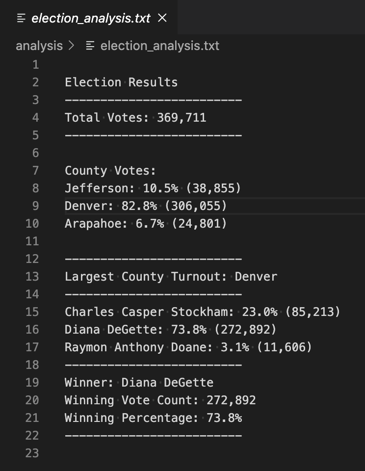

# Election_Analysis

## Project Overview
A Colorado Board of Elections employee has given you the following tasks to complete the election audit of a recent local congressional election.

1. Calculate the total number of votes cast.
2. Get a complete list of candidates who received votes.
3. Calculate the total number of votes each candidate received.
4. Calculate the percentage of votes each candidate won.
5. Determine the winner of the election based on popular vote.

## Resources
- Data Source: election_results.csv
- Software: Python 3.7.6, Visual Studio Code, 1.49

## Summary
The analysis of the election show that:
- There were 369,111 votes cast in the election.
- The candidates were:
    - Charles Casper Stockham
    - Diana DeGette
    - Raymon Anthony Doane
- The candidate results were:
    - Charles Casper Stockham received 23.0% of the vote and 85,213 number of votes.
    - Diana DeGette received 73.8% of the vote and 272,892 number of votes.
    - Raymon Anthony Doane received 3.1% of the vote and 11,606 number of votes.
- The winner of the election was:
    - Diana DeGette, who received 73.8% of the vote and 272,892 number of votes.

## Election-Audit Summary
In summary, the script written in Python was able to successfully provide calculated information on election data.  The script can calculate the total election count, county vote breakdowns used to determine the county with the largest number of votes.  It can also calculate the election results in total number of votes and the percentage of votes for each candidate.  Based on the calculations on candiate votes and results, the script can also help to determine the winner of the election.  

With a few adjustments to the code, it can be used for other elections.  Modifications may include:
- (1) modify the path of the data file to load and text file to save 
- (2) add other criteria if data was collected, similar to county data (ie., voter's age, income, etc.)

## Challenge Overview
This challenge required coding and updating files in github using python3 in VS Code and Terminal.  A script was created to analyze csv file data to determine the above listed outcomes.

## Challenge Summary
Module challenge included download & install of Python, Visual Studio Code and used Terminal native to Mac OS.  The challenge exercise included analysis of data using python and how to print the outcome to the terminal and in a text file.  It covered the python codes to load, open, read, create and write to file.  After the csv data file is opened, created counters to track each candidate's vote.  Python was also used to determine the percentage of votes for each candidate and finally the winner based on the populate or most votes.
